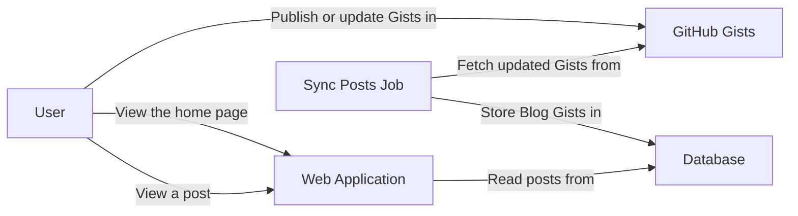

# Fardjad's Blog

This repository contains the source code of my
[personal blog](https://blog.fardjad.com). It automatically scans my published
[GitHub Gists](https://gist.github.com/fardjad) and shows the ones that are
tagged as blog posts in a nice and clean way, with a link to the original Gist
for comments and reactions.

In my opinion GitHub Gists are great for writing blog posts because:

- They support Markdown and hosting images.
- Readers can leave comments on the Gists.
- Gists are discoverable in search engines.
- Gists are version controlled.

## Running the Project

### Local Development

1. Clone the repository
2. Install [Deno](https://docs.deno.com/runtime/manual/#install-deno)
3. Install the Git hooks by running the following command:

   ```shell
   deno task hooks:install
   ```
4. Install [Turso CLI](https://docs.turso.tech/quickstart)

   _Hint: You can get a local server up and running by running `turso dev`._
5. Create a `.env` file in the root directory similar to
   [`.env.example`](./.env.example) and set the environment variables.
6. Run the following command to start the application:

   ```shell
   deno task dev
   ```

Running the application in development mode means:

1. The cache is disabled.
2. The HTML output is pretty-printed.
3. Tailwind CSS is compiled on the fly.

### Running in Production

Follow the same steps as above, but instead of running `deno task dev`, run the
following commands:

```shell
deno task build # only necessary after making changes to Tailwind classes
deno task start
```

If needed, you can clear the application cache by running the following command:

```shell
deno task clear-cache
```

### Deploying to Deno Deploy

Install [deployctl](https://docs.deno.com/deploy/manual/), run the following
command, and follow the prompts:

```shell
deployctl deploy --env-file .env
# a production deployment is needed to enable the cron job
deployctl deploy --prod
```

### GitHub Token

The synchronization job requires a
[GitHub token](https://github.com/settings/tokens/new) to fetch the Gists.
Ensure that the token is granted the `gist` scope; otherwise, it won't be able
to fetch secret Gists.

## How it works

The following diagram shows the high-level architecture of the blog:



There are two main components that can run independently of each other:

1. [The synchronization job](./src/cron/) that scans my Gists and stores the
   ones that are tagged as blog posts in a database.
2. The [web application](./src/server/app.ts) that reads the stored Gists and
   shows them in a nice and clean way.

### Synchronization Job

Gists are fetched from GitHub using the
[GitHub API](https://docs.github.com/en/rest/gists/gists?apiVersion=2022-11-28#list-gists-for-the-authenticated-user).
A **Blog Gist** is a Gist that meets the following criteria:

1. Its description matches the pattern: `[Title] Description #tag1 #tag2 ...`.
2. It has a non-empty title.
3. It has a `blog` tag.
4. It has at least one Markdown file.

When a Gist matches the above criteria, the synchronization job fetches the
content of its first Markdown file and stores it in the database. The job runs
every minute and fetches only the updated Gists since the last run (see the
`since` parameter in the
[API docs](https://docs.github.com/en/rest/gists/gists?apiVersion=2022-11-28#list-gists-for-the-authenticated-user--parameters)).

### Web Application

Every Blog Gist that gets stored in the database is called a
[**Post**](./src/blog/model/post.ts). Posts are assigned a **slug** based on
their **title**. For example a post with the title `Hello World` will have the
slug `hello-world` and can be accessed at `/posts/hello-world`. When two posts
have the same slug, the newer post will get a numeric suffix. For example, if
there are two posts with the title "Hello World", the first post will have the
slug `hello-world` and the second post will have the slug `hello-world-1`.

There are three routes in the web application:

1. The OpenGraph image route (`/og-image/:slug`) that generates an image for a
   post based on its content
1. The home page (`/`) that
   [shows some hard-coded content followed by the list of the posts stored in the database](./src/server/page/home.tsx)
1. The post page (`/posts/:slug`) that shows the content of a post

The posts are rendered on the server using a
[Markdown renderer](./src/markdown/markdown-renderer.ts). The renderer removes
the first heading with depth 1 (i.e., the first `h1` element) from the Markdown
content and replaces it with the post title followed by some extra information,
such as my name, the date of the post, and a link to the original Gist (see
[here](./src/server/page/post.tsx) for more details).

All pages are rendered on the server-side and
[cached](./src/server/cache/cache.ts) to reduce the load on the server.

## Noteworthy Dependencies

| Name                                                                       | Description                                              |
| -------------------------------------------------------------------------- | -------------------------------------------------------- |
| [Deno](https://deno.com/)                                                  | Javascript Runtime                                       |
| [Turso](https://turso.tech/)                                               | Database                                                 |
| [Hono](https://hono.dev/)                                                  | Web Application Framework                                |
| [Tailwind CSS](https://tailwindcss.com/)                                   | CSS Framework                                            |
| [remark](https://github.com/remarkjs)                                      | Markdown Processor                                       |
| [rehype](https://github.com/rehypejs)                                      | HTML Processor                                           |
| [github-markdown-css](https://github.com/sindresorhus/github-markdown-css) | CSS to replicate the style of GitHub Markdown            |
| [satori](https://github.com/vercel/satori)                                 | HTML+CSS to SVG converter (used for OG image generation) |
| [resvg](https://github.com/RazrFalcon/resvg)                               | SVG to PNG converter (used for OG image generation)      |
